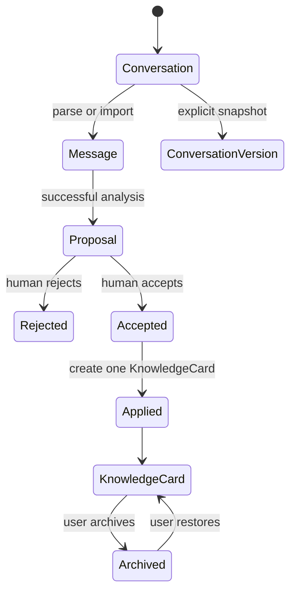
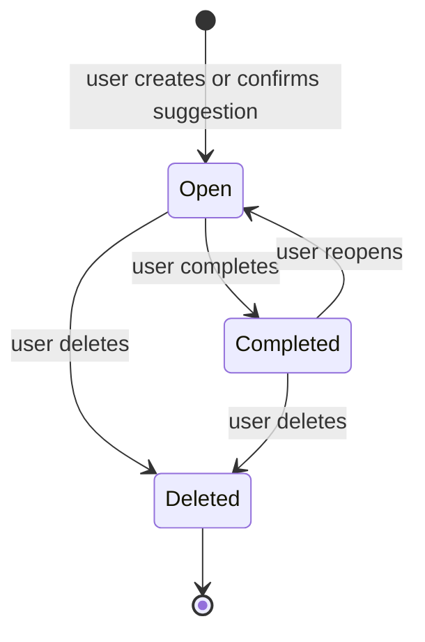

# Data Lifecycle

## General rules

- Core entities own business state; BrowserStorage owns keys, serialization, normalization, and compatibility.
- New fields must tolerate missing Sprint1–Sprint11 values without clearing or silently rewriting unrelated records.
- Destructive transitions require explicit user intent and clear impact text.
- Snapshots and broken references are displayed honestly; the system does not invent replacement provenance.

## Lifecycle summary

| Entity | Creation | Main transitions | Deletion / retention |
| --- | --- | --- | --- |
| Conversation | User creates or imports content. Missing Workspace normalizes to Inbox. | Rename, edit, move Workspace, open, copy; explicit restore changes Conversation fields and rebuilds Messages. | Explicit delete uses Conversation Workspace Service. Current Source/Messages/Versions and existing associated records follow the implemented aggregate policy; planned linked Tasks survive with source shown as `deleted`. |
| Message | Parsed from Source, imported, manually regenerated, copied, or rebuilt during restore. | User edit updates Message and Conversation timestamps. Proposal/Knowledge evidence snapshots do not change. | Removed by explicit regeneration/restore or Conversation cascade. Existing snapshots remain; linked evidence may report missing live reference. |
| ConversationVersion | User explicitly creates a named snapshot of Conversation + Messages. | Append-only; may be selected for explicit restore. Restore does not mutate the snapshot. | Removed only with its Conversation under the current policy; no individual deletion in v0.6. |
| Proposal | Successful AnalyzerRun produces a traceable pending result. | Pending → Accepted or Rejected; Accepted → Applied when one KnowledgeCard is created. | User may delete Proposal. Existing KnowledgeCard retains its accepted-time provenance snapshot. Analyzer failure never creates Proposal. |
| KnowledgeCard | Service creates exactly one from an Accepted Proposal after human Review. | User edits, tags, archives, or restores/archive state according to current UI. | Explicit delete removes KnowledgeCard but not its Tag identities; planned linked Tasks survive with source shown as `deleted`. |
| Tag | User creates a reusable classification. | Rename; associate/disassociate with KnowledgeCard. | Explicit delete removes Tag identity and unlinks its ID from KnowledgeCards; KnowledgeCards remain. |
| Workspace | System ensures Inbox; user creates regular Workspace. | Edit metadata, archive, restore; Conversation and planned Task can move between Workspaces. | Inbox cannot be deleted. Deleting a regular Workspace first rehomes Conversations and planned Tasks to Inbox, then removes only the Workspace. |
| Task (planned) | User explicitly creates a standalone Task or confirms an AI suggestion. | Edit; move Workspace; add/change date; open ↔ completed with timestamps; optional source may become missing. | Explicit Task delete affects no source. Conversation/Knowledge deletion never cascades to Task. Workspace deletion rehomes Task to Inbox. |
| Activity (planned) | A successful, meaningful domain transition emits a factual record after the business write succeeds. | Append-only; corrections are additional records rather than mutations. | Retention/deletion policy is not approved and must be frozen before Activity implementation. Activity never becomes current business state. |
| Conversation Note | User edits an optional field on Conversation. | Save trims content and updates Conversation `updatedAt`; cancel restores current value. | Removed with Conversation; does not mutate Source, Message, Proposal, or Knowledge. |
| SearchDocument | Built at runtime from canonical collections. | Rebuilt on page load; query adds score, snippet, matched fields and match mode. | Never persisted in v0.9; disappears with runtime state and never owns source data. |
| Asset metadata | User explicitly records filename/path/note for Conversation, Knowledge, Task, or Workspace. | Metadata can be listed and later extended through Asset Service. | Deleting metadata does not delete a filesystem file; browser never reads or copies the referenced file. |

## Conversation and knowledge path

AnalyzerRun is created when analysis starts and ends as success or failure. Only success may create Proposal; failure remains diagnostic history and cannot partially create knowledge.

## Planned Task lifecycle

Inbox / Today / Upcoming are derived open-Task views, and Completed is a derived completed-Task view. Moving between views changes `scheduledDate` or status; it does not create another entity.

Source deletion is not a Task transition. The Task remains open or completed while source resolution changes from available to `deleted`. Workspace deletion changes only Task placement to Inbox and preserves schedule/status.

## Planned Activity ordering

Activity is deliberately deferred. Before implementation, D4 must define event names, actor model, write ordering, retention, compatibility, and failure behavior. The minimum invariant is: failed business operations emit no success Activity, and failure to record Activity must not fabricate a successful business transition.
