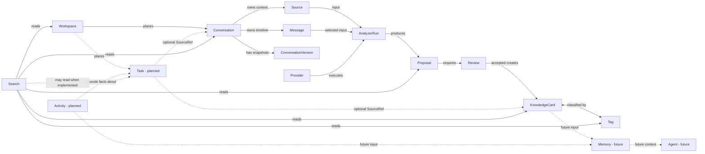

# Domain Model

## Status and notation

This model is the Architecture Pack v1 baseline for Epic D. Solid nodes are implemented in v0.6 unless marked otherwise; `Task` and `Activity` are planned, while `Memory` and `Agent` are future concepts without an implementation commitment.

The arrows describe allowed relationships, not ownership by the target. In particular, Search reads other domains without owning them; Provider executes analysis without deciding business state; Activity records facts without becoming the Task status source of truth.

## Domain glossary

| Domain / entity | Role |
| --- | --- |
| Workspace | Single-level placement for Conversation and planned Task; Inbox is the safe fallback. |
| Conversation | User-owned conversation context and aggregate entry point. |
| Source | Preserved raw imported material associated with a Conversation when available. |
| Message | Ordered, selectable conversation unit parsed from Source or edited by the user. |
| ConversationVersion | Append-only snapshot of Conversation and Messages for explicit restore. |
| AnalyzerRun | Execution record for one analysis attempt, including input, Provider, status, and error. |
| Proposal | Traceable Analyzer output awaiting human review. |
| Review | Human decision boundary that accepts or rejects a Proposal. |
| KnowledgeCard | Editable knowledge snapshot created only from an accepted Proposal. |
| Tag | Reusable classification associated with KnowledgeCard. |
| Provider | Replaceable analysis capability; Demo is default and Ollama is optional/local. |
| Search | Read model over existing collections; it owns no source entity or index today. |
| Task (planned) | Independent action with optional Conversation/Knowledge SourceRef and Workspace placement. |
| Activity (planned) | Append-only record of meaningful user/domain events; not immediate Epic D scope. |
| Memory (future) | Unapproved future context/retention capability, pending separate RFC and privacy model. |
| Agent (future) | Unapproved future actor capability, pending explicit authority and safety design. |

## Aggregate and reference rules

- Conversation owns its live Source, Messages, and ConversationVersions under existing use cases; Proposal and Knowledge keep evidence/provenance snapshots where defined.
- KnowledgeCard is not a Task container. Linking it to a Task does not transfer ownership in either direction.
- Task is independently deletable and completable. Conversation or Knowledge deletion leaves its SourceRef in a valid missing-target state displayed as `deleted`.
- Workspace deletion rehomes both Conversation and planned Task placement to Inbox according to each domain service; it does not delete their content.
- Activity, when designed, observes completed business transitions. Replaying Activity is not the source of current Task or Knowledge state in the planned local-first model.

## Evolution boundary

Epic D phase one implements only Task. Activity remains planned, and Memory/Agent remain future. Calendar, reminder, recurrence, RAG, and autonomous action are not implied by this model.

