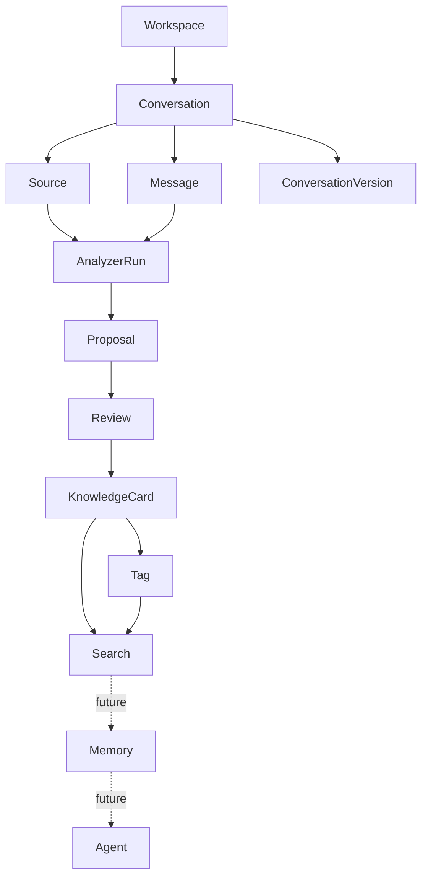

# Architecture Diagram

Epic B 将 Workspace 引入为 Conversation 的顶层归属，但仍保持 local-first、模块化单体和人工审核边界。

当前只实现到 Workspace、Conversation、Knowledge Editing 相关的 Phase2 能力。Memory 与 Agent 仅用于表达未来方向，不是当前实现范围；同样不引入 Workspace 树形层级、数据库、权限或云同步。
