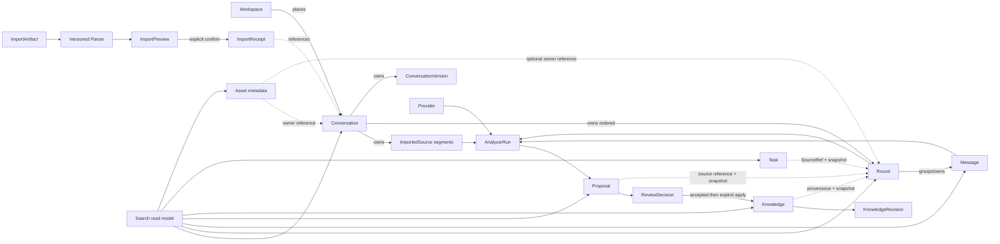

# v1.0 Phase0 Architecture Freeze Report

- Date: 2026-07-05
- Decision state: Freeze candidate complete; awaiting human approval
- Runtime state: unchanged
- Migration state: design only; not executed

## Freeze verdict

The Conversation–Round–Proposal–Knowledge–Search–Import model is internally consistent and has no unresolved ownership conflict. It is ready for human architecture approval.

It is **not yet an active implementation baseline**. Approval must be explicit. Until then, v0.9 runtime entities, storage and behavior remain authoritative, and no Sprint may implement Round or execute migration.

## Frozen definitions proposed

| Concept | Final definition |
| --- | --- |
| Conversation | One logical ordered dialogue thread; aggregate root for Source segments, Round, Message, Version and Note |
| Round | Stable interaction unit inside Conversation; child entity, not aggregate root |
| Question / Answer | Read/search projections over Round Messages; never separately persisted |
| Message | Canonical atomic raw/user-edited utterance; belongs to one Conversation and one Round |
| Proposal | Independent generated interpretation with target references and immutable evidence snapshots |
| ReviewDecision | Immutable explicit human accept/reject decision for one Proposal |
| Knowledge | Independent long-lived interpreted record with provenance and revision history |
| Search | Non-persistent read model; owns no canonical data and performs no mutation |
| Import | Preview-first application workflow using pure versioned Parsers; may create one or many Conversations |
| Session | Not introduced; its proposed meanings are already covered by Conversation, Workspace, ImportReceipt and Round |

## Final relationship map

Dashed references do not transfer ownership. External Asset file bytes remain outside browser storage and ownership.

## Search freeze

Default Search result kinds are:

1. Conversation
2. Knowledge
3. Round
4. Proposal
5. Task
6. Asset
7. Raw Message

Workspace and Tag are facets/context. ImportedSource is an advanced provenance result. Q&A Pair is superseded by Round. One typed SearchResult contract carries canonical identity, context, anchor, snippet, matched fields, match mode, score, facets and live-reference state.

## Import freeze

- Clipboard is a channel; GPT Export, Claude Export, Markdown, TXT and JSON are formats.
- Parsers are pure/versioned and never write storage.
- Parse results retain warnings, unsupported/unconsumed content, counts and provenance.
- Preview and explicit confirmation precede every write.
- One export may create multiple Conversations under one metadata-only ImportReceipt.
- Content Import is distinct from PALOS backup/restore.

## Knowledge freeze

- Proposal remains untrusted until an immutable human ReviewDecision accepts it.
- Accepted does not auto-mutate Knowledge; explicit idempotent apply is required.
- Apply creates Knowledge or appends a KnowledgeRevision to an explicit target.
- Direct user edits also append revisions.
- Knowledge does not belong to Conversation or Round and survives source deletion with evidence snapshots.
- Task remains independent; Knowledge status never controls Task status.

## Migration freeze

The future Message-to-Round migration must be deterministic, staged, validated, idempotent and recoverable. It preserves Message IDs/content/order/timestamps and all existing evidence snapshots. It does not rewrite immutable ConversationVersion snapshots. A valid recovery export is a hard precondition. No automatic page-load migration is allowed.

Detailed plan: [Message to Round Migration Design](../design/Message-to-Round-Migration-v1.0.md).

## Compatibility and implementation delta

The freeze intentionally describes the target domain, not current runtime completion. Approval creates implementation obligations:

- add Round Entity/Contract/Storage/Service and safe legacy reads;
- implement migration staging/recovery before committing live data;
- update copy/delete/restore/import orchestration for Round;
- stop cascading default Conversation deletion into Proposal/Knowledge;
- introduce ReviewDecision and KnowledgeRevision with legacy backfill rules;
- consolidate SearchResult vocabulary and add Asset/Raw Message/Round default results;
- implement Parser/ImportReceipt boundaries;
- update Task source type support only if Round source creation is approved in an implementation Sprint.

Each obligation requires its own approved scope and acceptance criteria. Phase0 authorizes none of them.

## Conflict checklist

| Question | Resolution |
| --- | --- |
| Is Conversation a chat, import, topic or project? | One logical chat/dialogue thread |
| Is Round an aggregate root? | No; stable child entity of Conversation |
| Does Round own Question/Answer? | It supplies their Message projection; no separate entities |
| Does Round own Proposal/Knowledge? | No; both are independent aggregates with references/snapshots |
| Is Session needed? | No |
| Does Search own an index or source data? | No; runtime read model only |
| Does Import write during parsing? | No; write only after preview/confirmation through ImportService |
| Can Analyzer create/update Knowledge? | No |
| Does source deletion delete Knowledge by default? | No; live reference degrades and snapshots remain |
| Can browser Asset metadata delete files? | No |

All questions are resolved. There is no open model contradiction blocking approval.

## Documents in the freeze package

- `docs/reviews/Architecture-Review-v1.0-Phase0.md`
- `docs/rfc/RFC-005-conversation-round-model.md`
- `docs/design/Message-to-Round-Migration-v1.0.md`
- `docs/rfc/RFC-006-import-parser-contract.md`
- `docs/rfc/RFC-007-search-result-contract.md`
- `docs/rfc/RFC-008-proposal-review-knowledge-lifecycle.md`
- `docs/adr/ADR-004-conversation-remains-aggregate-root.md`
- updated `ARCHITECTURE.md`, `PROJECT.md`, `ROADMAP.md`, architecture pack and `HANDOFF.md`

## Human approval gate

Approve only if all of the following are accepted together:

- Conversation means one logical dialogue thread.
- Round is a child entity, not an aggregate root.
- Session is excluded from v1.0.
- Proposal/Knowledge survive source deletion by default.
- ReviewDecision and KnowledgeRevision are part of the target model.
- Search defaults to the seven frozen result kinds.
- Import is preview-first and Parser is pure/versioned.
- Migration cannot run before recovery export, staging and rollback exist.

If any item is rejected, Phase0 must reopen before implementation. After approval, the v1.x rule is: no Domain relationship changes; later work may implement or optimize behind these boundaries only. Any requested domain change must wait for a post-v1.x architecture cycle.

## Work performed and verification boundary

- Documentation only.
- No `src/`, package, dependency, LocalStorage or runtime changes.
- No Round implementation.
- No migration execution.
- No commit.
- Automated repository gates are recorded in `HANDOFF.md`; manual architecture approval remains pending.
